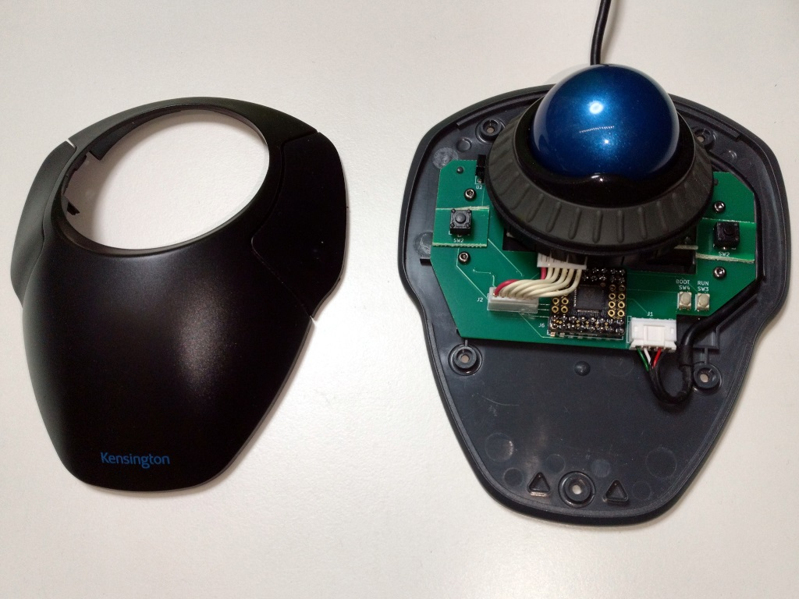
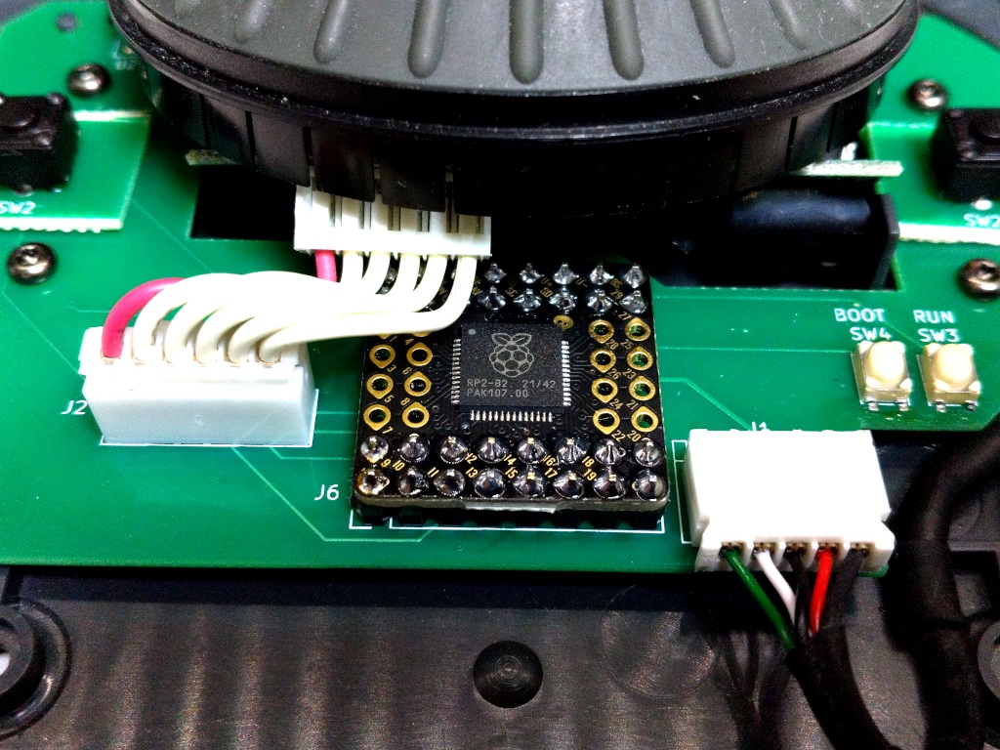

# PCB for Kensington trackball with RP2040

[Kensington Orbit Trackball with Scroll Ring](https://www.kensington.com/p/products/electronic-control-solutions/trackball-products/orbit-trackball-with-scroll-ring/)の基板を[PGA2040](https://shop.pimoroni.com/products/pga2040)を使っ基板に置き換えるためのKiCadプロジェクト

## 基板発注時の注意

板厚は**1.2mm**です。

## 主要部品

|部品|入手先|備考|
|-|-|-|
|PGA2040|<https://akizukidenshi.com/catalog/g/gM-16762/>|Raspberry pi picoと同じCPU|
|IR928-6C-F|<https://www.marutsu.co.jp/pc/i/12907560/>|ホイール用ロータリーエンコーダのLED 見た目が同じなので選択|
|PT5529B/L2/H3|<https://www.marutsu.co.jp/pc/i/13719542/>|ホイール用ロータリーエンコーダのフォトトランジスタ 見た目が同じなので選択|
|NJM4580|<https://akizukidenshi.com/catalog/g/gI-14003/>|手元にあったオペアンプ 本物は[LMV393](https://www.ti.com/product/ja-jp/LMV393)が使用されてます。|
|B6B-PH-K-S|<https://www.marutsu.co.jp/pc/i/46628/>|ADNS-5050との接続用コネクタ|
|S5B-PH-K-S|<https://www.marutsu.co.jp/pc/i/54957/>|USBケーブルとの接続用コネクタ|
|kailh mute switch|<https://www.amazon.co.jp/s?k=kailh+mute+switch>|マウスボタン [秋月のタクトスイッチ](https://akizukidenshi.com/catalog/g/gP-14892/)で代用（底上げが必要）|
|タクトスイッチ|<https://akizukidenshi.com/catalog/g/gP-06184/>|RP2040のリセットとモード選択用|

## ソフトウェア

作成中で、まだ基板が正しいか確認できてません。（[GR-ROSE版](https://github.com/h7ga40/azure_iot_hub_rose/tree/main/app_iothub_client/tinyusb)ではある程度動いています。）

下記のソフトを使用する予定。

- [Raspberry Pi Pico SDK](https://github.com/raspberrypi/pico-sdk)
- [TinyUSB](https://github.com/hathach/tinyusb)
- [ADNS-5050](https://github.com/okhiroyuki/ADNS5050)

## 部品実装

PGA2040周辺はこのような感じ

## その他の情報

[コネクテッド・マウス](https://www.slideshare.net/HiroakiNagashima1/ss-250643168)
